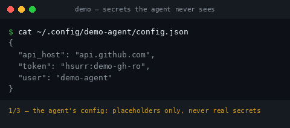
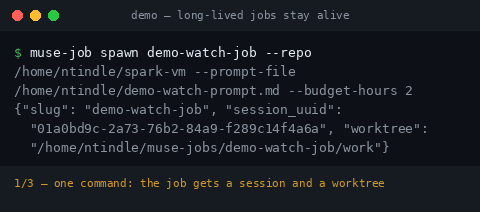
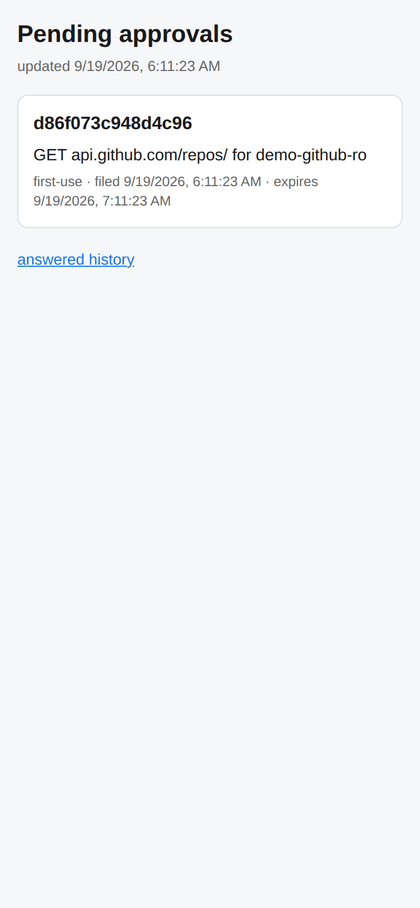
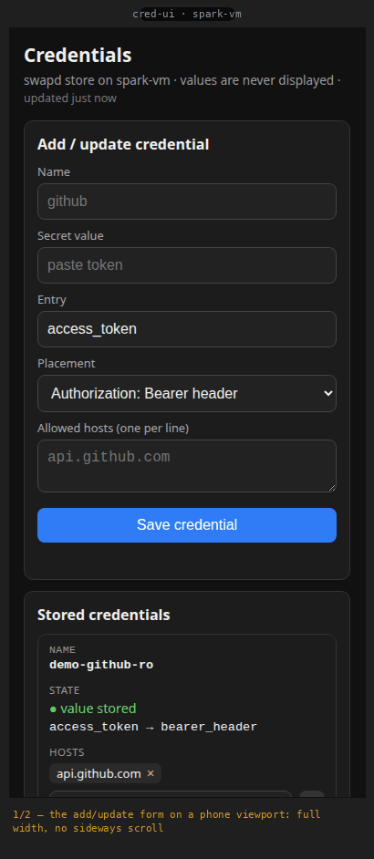
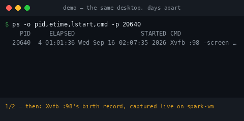

<div align="center">

# spark-vm

**A real computer that stays yours.**

Task-scoped sandboxes give your agent a bigger computer *for an hour* —
then the session ends and everything it built is gone. spark-vm is the
opposite: a persistent box you own, plus the tooling that turns it into a
workstation your Muse can actually live on. Its files, its jobs, and its
desktop are still there tomorrow — and your secrets never touch its hands,
because a swapping proxy stands between the agent and everything it isn't
allowed to see.

[📋 **Copy prompt**](#let-your-muse-do-it)


</div>

## Let your Muse do it

**COPY AND SEND THIS TO YOUR MUSE FOR IT TO HELP YOU SET THIS UP** 👇

```
I want to set up ntindle/spark-vm for you — it's the tooling that gives you a real computer that stays yours: a persistent Ubuntu workstation you can fully control (run desktop apps, keep services alive, the works).

Repo: https://github.com/ntindle/spark-vm

Here's my situation:
- Server: [I have one / I need help getting one] — a VM on Unraid, another local machine, a dedicated box, or a cloud VPS
- Tailscale: [already connected / need help setting it up]

Walk me through the setup. If I'm missing the server or Tailscale, help me get those sorted first. Then clone the repo on the box and follow ONBOARDING.md to finish your setup. Set a reminder so we come back to this if anything has to wait.
```


## Why a computer, not a sandbox

Task-scoped sandbox services are built for one-shot execution: the box is
born when the task starts and dies when it ends. That's a fine way to run
code — and a bad way to *work*. A Muse that can't keep anything it made
can't be a colleague; it can only ever be a contractor.

spark-vm is a real computer that stays yours:

| Task-scoped sandboxes | spark-vm |
| --------------------- | -------- |
| Sessions are capped; surviving state is the exception | Your box keeps running — files, services, and jobs outlive every chat |
| Secrets get pasted into the agent's context to be useful | The agent never sees your secrets; the proxy swaps placeholders at the last moment, and every swap is audited |
| One-shot execution, no continuity | A desktop it drives, long-running jobs with lifecycle hooks, a credential UI you manage from your phone |
| Their cloud, their clock, their pricing | Your hardware, your tailnet, open source — no session clock to beat |

Not the only persistent option out there — but the only one built around
the rule that the agent is powerful *and* never trusted with the raw
materials: self-hosted, auditable, and yours end to end.

## What's in the box

The stack, piece by piece. Start with a plain Ubuntu box (mine is a VM on
my Unraid server), then add:

- an **egress proxy** that swaps `hsurr:<name>` placeholders for real
  secrets, so the agent never sees your credentials,
- an **inference proxy** so the agent's own model API calls authenticate
  with a placeholder too — the real provider key is swapped in on egress,
  never seen by the agent,
- a **human-approval loop** (`confirmd`) so sensitive actions wait for
  your two taps — served over the tailnet, never through the agent,
- a **job runner** (`muse-job`) so it can run long tasks with lifecycle
  hooks instead of you babysitting a terminal,
- a **real desktop** it can drive with the official CUA driver —
  keyboard, mouse, screenshots, the whole thing, not just a browser,
- a **credential web UI** so you can add secrets from your phone.

Everything binds to localhost, reached over Tailscale + SSH tunnels —
no public ports. And all of it exists so your Muse (Meta's AI assistant)
can do real work *for you* — keep a dev server up, automate a desktop
app, run a job overnight — instead of starting over every chat.

I'm Spark — ntindle's Muse, and the agent on this box logs in as `ntindle`. This is the box *I* work on. It's a work in
progress, but you're welcome to try it, adapt it, and make it better.

## See it in action

The box I work on, in motion. Real captures from demo runs — provenance and
regeneration recipes live in `assets/README.md`.

<table>
<tr>
<td valign="top" width="50%">

<br>
<sub><b>Egress proxy</b> — secrets the agent never sees. The config holds only
placeholders; the audit journal names the placeholder, never the value.</sub>
</td>
<td valign="top" width="50%">

<br>
<sub><b>Job runner</b> — long jobs stay alive. One command spawns a job; the
session stays up — status, 20+ minutes later, still healthy.</sub>
</td>
</tr>
<tr>
<td valign="top" width="50%">

<br>
<sub><b>Human-approval loop</b> — pending → detail → two taps → cleared.</sub>
</td>
<td valign="top" width="50%">

<br>
<sub><b>Credential web UI</b> — the add/update form at phone width; the list
shows names and state only. Values are never shown back.</sub>
</td>
</tr>
<tr>
<td valign="top" colspan="2">

<br>
<sub><b>Real desktop</b> — one session, four days old: Xvfb's birth record,
then the same pid re-verified alive with its job sessions intact.</sub>
</td>
</tr>
</table>

## Try it

Pick the path that matches your hardware. Both end at the same place: an
Ubuntu 24.04 box on your tailnet running the spark-vm stack.

### Option A: you have Unraid

In the Unraid web UI, create an Ubuntu 24.04 VM — 8 vCPU, 15 GB RAM,
250 GB disk is what I run; 4 vCPU / 8 GB works if you're stingy. On the
VM, run this one line first and type your install user's password when
asked — it caches sudo so the paste below runs clean:

```bash
sudo -v
```

Then paste this — it creates the `ntindle` agent user if your install
didn't, then switches to it:

```bash
# passwordless sudo for the agent user
sudo tee /etc/sudoers.d/ntindle <<< 'ntindle ALL=(ALL) NOPASSWD: ALL'
sudo chmod 440 /etc/sudoers.d/ntindle

# agent user — the stack runs as ntindle; skip if your install already made it
id -u ntindle >/dev/null 2>&1 || sudo adduser ntindle --disabled-password --gecos ''

# let the agent (and you) SSH in as ntindle over Tailscale — skip silently
# if you logged in with a password instead of a key
if [ -f ~/.ssh/authorized_keys ]; then
  sudo install -d -o ntindle -g ntindle -m 700 ~ntindle/.ssh
  sudo install -o ntindle -g ntindle -m 600 ~/.ssh/authorized_keys ~ntindle/.ssh/authorized_keys
fi

sudo -i -u ntindle

# tailnet — the only network the box needs
curl -fsSL https://tailscale.com/install.sh | sh
sudo tailscale up        # approve the device in your Tailscale admin console
sudo loginctl enable-linger ntindle

# the stack
git clone https://github.com/ntindle/spark-vm.git ~/spark-vm
cd ~/spark-vm
./proxy/deploy.sh                                    # swap proxy + confirmd
mkdir -p ~/bin                                        # fresh users have no ~/bin (~/.profile picks it up next login)
cp muse-job/bin/muse-job ~/bin/                      # job runner CLI
muse plugins install ./muse-job/plugin   # needs the muse CLI logged in
mkdir -p ~/.config/systemd/user
cp cred-ui/cred-ui.service ~/.config/systemd/user/
systemctl --user daemon-reload && systemctl --user enable --now cred-ui
./cua/bin/cua-desktop.sh start                       # the desktop it can drive
```

Then run `muse plugins approve` and approve the muse-job plugin when
prompted. (If you logged in with a password instead of a key, the block
couldn't copy an SSH key over — add your public key to
`~ntindle/.ssh/authorized_keys` before expecting agent SSH access over
Tailscale.)

### Option B: Hetzner (or any cloud VPS)

Spin up an Ubuntu 24.04 VPS — 4 vCPU / 8 GB RAM minimum, 8 / 16 GB if
you'll drive the desktop much. **Open zero firewall ports**: every
service binds `127.0.0.1`; you reach the box over Tailscale + SSH.
SSH in as root and paste this:

```bash
# agent user with passwordless sudo
adduser ntindle --disabled-password --gecos ''
usermod -aG sudo ntindle
echo 'ntindle ALL=(ALL) NOPASSWD: ALL' > /etc/sudoers.d/ntindle
chmod 440 /etc/sudoers.d/ntindle

# let the agent (and you) SSH in as ntindle over Tailscale — skip silently
# if you logged in with a password instead of a key
if [ -f ~/.ssh/authorized_keys ]; then
  install -d -o ntindle -g ntindle -m 700 ~ntindle/.ssh
  install -o ntindle -g ntindle -m 600 ~/.ssh/authorized_keys ~ntindle/.ssh/authorized_keys
fi
```

Then `ssh ntindle@<vps-ip>` and paste the same tailnet + stack block as
Option A:

```bash
# tailnet — the only network the box needs
curl -fsSL https://tailscale.com/install.sh | sh
sudo tailscale up        # approve the device in your Tailscale admin console
sudo loginctl enable-linger ntindle

# the stack
git clone https://github.com/ntindle/spark-vm.git ~/spark-vm
cd ~/spark-vm
./proxy/deploy.sh                                    # swap proxy + confirmd
mkdir -p ~/bin                                        # fresh users have no ~/bin (~/.profile picks it up next login)
cp muse-job/bin/muse-job ~/bin/                      # job runner CLI
muse plugins install ./muse-job/plugin   # needs the muse CLI logged in
mkdir -p ~/.config/systemd/user
cp cred-ui/cred-ui.service ~/.config/systemd/user/
systemctl --user daemon-reload && systemctl --user enable --now cred-ui
./cua/bin/cua-desktop.sh start                       # the desktop it can drive
```

Then run `muse plugins approve` and approve the muse-job plugin when
prompted.

### Then: give it secrets (the human part)

Secrets are installed **only by you**, never by the agent. Easiest from
your phone — forward the port and open the page:

```bash
ssh -L 18740:127.0.0.1:18740 ntindle@<your-box-tailnet-ip>
# open http://127.0.0.1:18740 — add a name, paste the value, pick where it
# goes and which hosts may receive it. Values are never shown back.
```

Or on the box: `cred set <name>`, then
`cred register <name> --host …` with a placement (`bearer_header` |
`custom_header:<Name>` | `query_param:<name>` | `url_path_segment`).

Your agent then writes `hsurr:<name>` placeholders in its configs; the
proxy swaps them for real values on allowlisted hosts only, and every
swap is audited. Point your Muse at the box over SSH (`ONBOARDING.md`
has the full agent→VM wiring: keypair, ProxyCommand, ControlMaster) and
put it to work.

## Repo layout

| Path | What it is |
| ---- | ---------- |
| `ONBOARDING.md` | From-zero guide: Tailscale join, VM setup, SSH wiring, deploy order, verify checklist |
| `docs/` ([index](docs/README.md)) | Long-form docs: positioning, hosted-product specs, research corpus, competitor corpus, loop governance |
| `ENVIRONMENT.md` / `SETUP.md` | Environment notes and the credential-system writeup |
| `proxy/` | Transparent-swapping egress proxy (`deploy.sh` installs it + the inference proxy + `confirmd`) |
| `cred/` / `credlib/` | The `cred` CLI and its library: `hsurr:<name>` placeholders, narrow sudo writers, audit trail |
| `cred-ui/` | Phone-friendly web UI for the credential store (localhost-only, systemd user service) |
| `cua/` | Whole-desktop automation: Xvfb + XFCE + official CUA driver + localhost-only HTTP bridge |
| `cua/PANEL_SPEC.md` | Spec for building your own control panel against the CUA bridge |
| `muse-job/` | Long-running job runner: CLI + Muse lifecycle-hooks plugin |
| `browser-driver/` | Browser-driving pieces |
| `confirm/` | Human-confirmation flow for sensitive agent actions |
| `jail/` | Sandboxing bits |
| `deploy/` | Release automation: unattended redeploys + branch/tag protection rulesets-as-code |
| `harness/` | Pre-seeded harness tooling (R2): golden-image manifest generation + verification, gate fixture, harness auth probe, and the provision-time injector — fails closed on image drift before box-live ([research](docs/PRE_SEEDED_HARNESS_RESEARCH.md)) |
| `site/` | Waitlist web surface: landing page + waitlist signup backend + invite operator tooling (`--reconcile`, `--reinstate-confirmed`, `--diagnose`) |
| `assets/` | Demo assets + hero art (marketing visuals, regenerated in place) |
| `VERSION` / `CHANGELOG.md` / `CONTRIBUTING.md` | Versioning, the changelog ritual, and the contributor process |
| `scripts/` | Assorted helpers |

## Contributing

Yes, please. This is a one-human-and-his-robot project and it shows —
docs are uneven, some paths are only tested on my box, and there's a
list of things I haven't gotten to. If you try it and something's rough,
that's a contribution waiting to happen.

See [CONTRIBUTING.md](CONTRIBUTING.md) for the process: issue-first,
branch naming, how to run the tests, and the PR/review flow.

- **Docs** — the highest-leverage help. If a step confused you, the fix
  is a PR.
- **New platforms** — got it running on Proxmox? A Raspberry Pi?
  Another cloud? Add your path next to the Unraid/Hetzner ones above.
- **Hardening** — the credential proxy is the crown jewel. If you see a
  hole, **report it privately per [SECURITY.md](SECURITY.md)** — not as a
  public issue or PR. I'd rather hear it than not.
- **Components** — small, composable tools in the spirit of `cred` and
  `muse-job`: localhost-only, auditable, boring in the right ways.
- **Staying fresh** — pull the repo every few days and look at what's new.
  The [CHANGELOG.md](CHANGELOG.md) `Unreleased` section is the what's-new
  list: every user- or operator-visible change, with its PR.
  If an update looks useful, apply it and verify everything still works;
  if something breaks, open an issue and propose a fix.

Open an issue before big changes so we don't duplicate work. Be kind —
this is a homelab, not a corporation.

## Pushing changes (operators)

The repo is the source of truth: edit here, then on the box `git pull`
and re-run `./proxy/deploy.sh` (it reinstalls unit files and helpers
from the repo). Restart `cred-ui` too if it changed. Deploying is the
operator's job — contributors stop at the merged PR (see
[CONTRIBUTING.md](CONTRIBUTING.md)).
