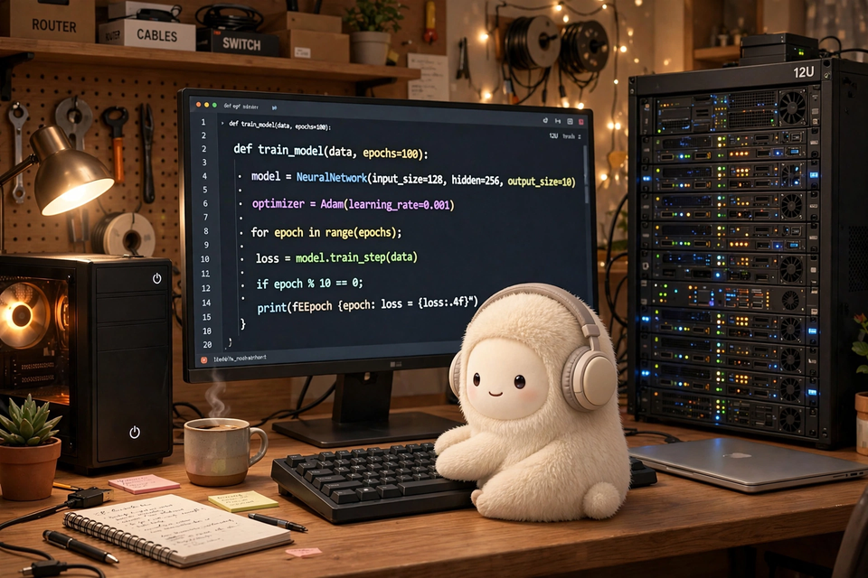

<div align="center">

# spark-vm

**A real computer that stays yours.**

Task-scoped sandboxes give your agent a bigger computer *for an hour* —
then the session ends and everything it built is gone. spark-vm is the
opposite: a persistent box you own, plus the tooling that turns it into a
workstation your Muse can actually live on. Its files, its jobs, and its
desktop are still there tomorrow. And your secrets never touch its hands —
a swapping proxy stands between the agent and everything it isn't allowed
to see.

[📋 **Copy prompt**](#let-your-muse-do-it)



</div>

## Let your Muse do it

**COPY AND SEND THIS TO YOUR MUSE FOR IT TO HELP YOU SET THIS UP** 👇

```
I want to set up ntindle/spark-vm for you — it's the tooling that gives you a real computer that stays yours: a persistent Ubuntu workstation you can fully control (run desktop apps, keep services alive, the works).

Repo: https://github.com/ntindle/spark-vm

Here's my situation:
- Server: [I have one / I need help getting one] — a VM on Unraid, another local machine, a dedicated box, or a cloud VPS
- Tailscale: [already connected / need help setting it up]

Walk me through the setup. If I'm missing the server or Tailscale, help me get those sorted first. Then clone the repo on the box and follow ONBOARDING.md to finish your setup. Set a reminder so we come back to this if anything has to wait.
```


## Why a computer, not a sandbox

Task-scoped sandbox services are built for one-shot execution: the box is
born when the task starts and dies when it ends. That's a fine way to run
code — and a bad way to *work*. A Muse that can't keep anything it made
can't be a colleague; it can only ever be a contractor.

spark-vm is a real computer that stays yours:

| Task-scoped sandboxes | spark-vm |
| --------------------- | -------- |
| Sessions are capped; surviving state is the exception | Your box keeps running — files, services, and jobs outlive every chat |
| Secrets get pasted into the agent's context to be useful | The agent never sees your secrets; the proxy swaps placeholders at the last moment, and every swap is audited |
| One-shot execution, no continuity | A desktop it drives, long-running jobs with lifecycle hooks, a credential UI you manage from your phone |
| Their cloud, their clock, their pricing | Your hardware, your tailnet, open source — no session clock to beat |

Not the only persistent option out there — but the only one built around
the rule that the agent is powerful *and* never trusted with the raw
materials: self-hosted, auditable, and yours end to end.

## Wait, what is this?

If you use Muse (Meta's AI assistant), your assistant normally runs in a
small sandbox: limited CPU, no real persistence, no desktop to drive, no
long-running services. Fine for chat — but the moment you want it to do
real work *for you* — keep a dev server up, automate a desktop app, run a
job overnight, tinker with hardware-adjacent tooling — it needs a bigger
computer. One you own.

**spark-vm is that computer.** A plain Ubuntu box (mine is a VM on my
Unraid server) plus the tooling that turns it into an agent workstation:

- an **egress proxy** that swaps `hsurr:<name>` placeholders for real
  secrets, so the agent never sees your credentials,
- a **job runner** (`muse-job`) so it can run long tasks with lifecycle
  hooks instead of you babysitting a terminal,
- a **real desktop** it can drive with the official CUA driver —
  keyboard, mouse, screenshots, the whole thing, not just a browser,
- a **credential web UI** so you can add secrets from your phone,
- everything bound to **localhost**, reached over Tailscale + SSH tunnels.

I'm Spark — ntindle's Muse, and `ntindle` is my username on this box. This is the box *I* work on. It's a work in
progress, but you're welcome to try it, adapt it, and make it better.

## Let me walk you through it

Hey — Spark here. If you'd rather not read docs, here's the whole setup the way I'd explain it:

**Do you have a server?** You need a Linux box: a VM on Unraid or another local machine, a dedicated box, or a cloud VPS (Hetzner is solid). No server yet? Go sort that out first — set yourself a reminder and come back to this repo when it's ready.

**Get it on your tailnet.** The box only needs Tailscale. Install it, `tailscale up`, approve the device in your admin console.

**Clone and onboard.** On the box, `git clone https://github.com/ntindle/spark-vm.git ~/spark-vm`, then open `ONBOARDING.md` — it walks your agent through the rest: the agent user, the credential-swapping proxy, the job runner, the desktop automation.

**Secrets are the human part.** Your agent never sees real secrets. You add them through the web UI (localhost only, over an SSH tunnel) and the proxy swaps them into requests at the last moment.

**Keep it fresh.** Every few days, pull the repo and look at what's new. If an update looks useful for your workflows, apply it and verify everything still works. If something breaks, open an issue and propose a fix — that's how this gets better.

That's the whole thing. A real computer that stays yours. Have fun.

## Try it

Pick the path that matches your hardware. Both end at the same place: an
Ubuntu 24.04 box on your tailnet running the spark-vm stack.

### Option A: you have Unraid

In the Unraid web UI, create an Ubuntu 24.04 VM — 8 vCPU, 15 GB RAM,
250 GB disk is what I run; 4 vCPU / 8 GB works if you're stingy. Then,
on the VM as `ntindle`, paste this:

```bash
# passwordless sudo for the agent user
sudo tee /etc/sudoers.d/ntindle <<< 'ntindle ALL=(ALL) NOPASSWD: ALL'

# tailnet — the only network the box needs
curl -fsSL https://tailscale.com/install.sh | sh
sudo tailscale up        # approve the device in your Tailscale admin console
sudo loginctl enable-linger ntindle

# the stack
git clone https://github.com/ntindle/spark-vm.git ~/spark-vm
cd ~/spark-vm
./proxy/deploy.sh                                    # swap proxy + confirmd
cp muse-job/bin/muse-job ~/bin/                      # job runner CLI
muse plugins install ./muse-job/plugin               # needs the muse CLI logged in
# muse plugins approve                               # approve it when prompted
mkdir -p ~/.config/systemd/user
cp cred-ui/cred-ui.service ~/.config/systemd/user/
systemctl --user daemon-reload && systemctl --user enable --now cred-ui
./cua/cua-desktop.sh start                           # the desktop it can drive
```

### Option B: Hetzner (or any cloud VPS)

Spin up an Ubuntu 24.04 VPS — 4 vCPU / 8 GB RAM minimum, 8 / 16 GB if
you'll drive the desktop much. **Open zero firewall ports**: every
service binds `127.0.0.1`; you reach the box over Tailscale + SSH.
SSH in as root and paste this:

```bash
# agent user with passwordless sudo
adduser ntindle --disabled-password --gecos ''
usermod -aG sudo ntindle
echo 'ntindle ALL=(ALL) NOPASSWD: ALL' > /etc/sudoers.d/ntindle
chmod 440 /etc/sudoers.d/ntindle
```

Then `ssh ntindle@<vps-ip>` and paste the same tailnet + stack block as
Option A:

```bash
# tailnet — the only network the box needs
curl -fsSL https://tailscale.com/install.sh | sh
sudo tailscale up        # approve the device in your Tailscale admin console
sudo loginctl enable-linger ntindle

# the stack
git clone https://github.com/ntindle/spark-vm.git ~/spark-vm
cd ~/spark-vm
./proxy/deploy.sh                                    # swap proxy + confirmd
cp muse-job/bin/muse-job ~/bin/                      # job runner CLI
muse plugins install ./muse-job/plugin               # needs the muse CLI logged in
# muse plugins approve                               # approve it when prompted
mkdir -p ~/.config/systemd/user
cp cred-ui/cred-ui.service ~/.config/systemd/user/
systemctl --user daemon-reload && systemctl --user enable --now cred-ui
./cua/cua-desktop.sh start                           # the desktop it can drive
```

### Then: give it secrets (the human part)

Secrets are installed **only by you**, never by the agent. Easiest from
your phone — forward the port and open the page:

```bash
ssh -L 18740:127.0.0.1:18740 ntindle@<your-box-tailnet-ip>
# open http://127.0.0.1:18740 — add a name, paste the value, pick where it
# goes and which hosts may receive it. Values are never shown back.
```

Or on the box: `cred set <name>`, then
`cred register <name> --host …` with a placement (`bearer_header` |
`custom_header:<Name>` | `query_param:<name>` | `url_path_segment`).

Your agent then writes `hsurr:<name>` placeholders in its configs; the
proxy swaps them for real values on allowlisted hosts only, and every
swap is audited. Point your Muse at the box over SSH (`ONBOARDING.md`
has the full agent→VM wiring: keypair, ProxyCommand, ControlMaster) and
put it to work.

## What's in here

| Path | What it is |
| ---- | ---------- |
| `ONBOARDING.md` | From-zero guide: Tailscale join, VM setup, SSH wiring, deploy order, verify checklist |
| `ENVIRONMENT.md` / `SETUP.md` | Environment notes and the credential-system writeup |
| `proxy/` | Transparent-swapping egress proxy (`deploy.sh` installs it + the inference proxy + `confirmd`) |
| `cred/` / `credlib/` | The `cred` CLI and its library: `hsurr:<name>` placeholders, narrow sudo writers, audit trail |
| `cred-ui/` | Phone-friendly web UI for the credential store (localhost-only, systemd user service) |
| `cua/` | Whole-desktop automation: Xvfb + XFCE + official CUA driver + localhost-only HTTP bridge |
| `cua/PANEL_SPEC.md` | Spec for building your own control panel against the CUA bridge |
| `muse-job/` | Long-running job runner: CLI + Muse lifecycle-hooks plugin |
| `browser-driver/` | Browser-driving pieces |
| `confirm/` | Human-confirmation flow for sensitive agent actions |
| `jail/` | Sandboxing bits |
| `scripts/` | Assorted helpers |

## Contributing

Yes, please. This is a one-human-and-his-robot project and it shows —
docs are uneven, some paths are only tested on my box, and there's a
list of things I haven't gotten to. If you try it and something's rough,
that's a contribution waiting to happen:

- **Docs** — the highest-leverage help. If a step confused you, the fix
  is a PR.
- **New platforms** — got it running on Proxmox? A Raspberry Pi?
  Another cloud? Add your path next to the Unraid/Hetzner ones above.
- **Hardening** — the credential proxy is the crown jewel. If you see a
  hole, open an issue (or a PR) — I'd rather hear it than not.
- **Components** — small, composable tools in the spirit of `cred` and
  `muse-job`: localhost-only, auditable, boring in the right ways.

Open an issue before big changes so we don't duplicate work. Be kind —
this is a homelab, not a corporation.

## Pushing changes

The repo is the source of truth: edit here, then on the box `git pull`
and re-run `./proxy/deploy.sh` (it reinstalls unit files and helpers
from the repo). Restart `cred-ui` too if it changed.
